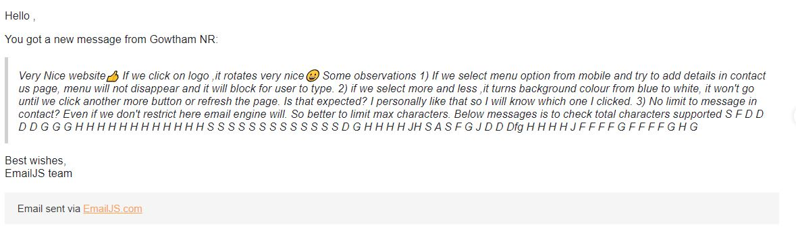
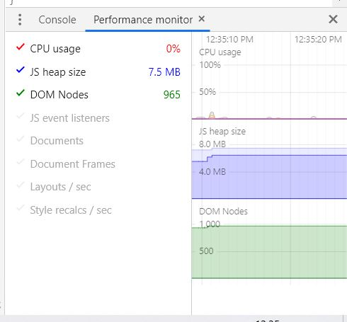
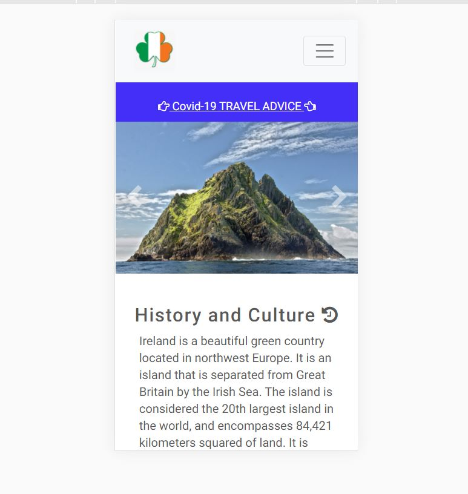
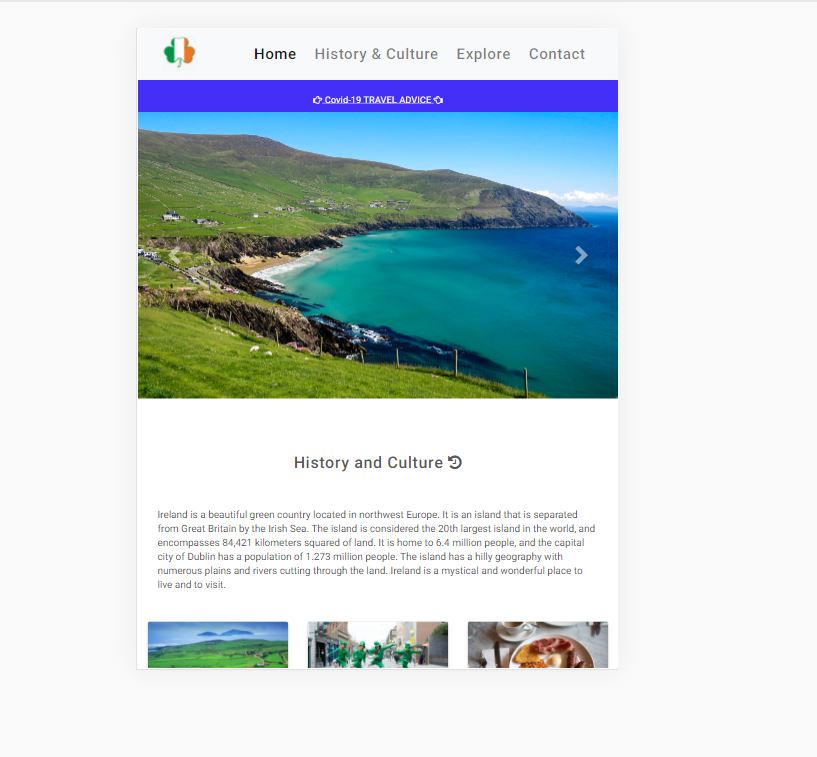
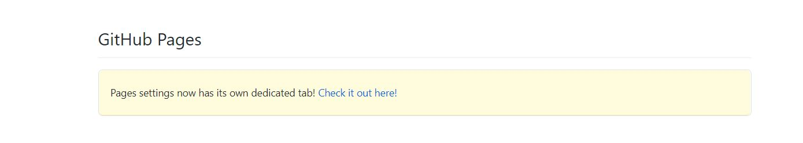

Milestone_Project-2_Code-Institute

# Explore-Ireland-MS2

## About
___

* The aim of this website is to promote Ireland as a travel destination.The Emerald Isle is fantastic for road trips, for hiking, discovering castles, eating seafood and sipping on whiskey. On top of the many buzzing cities, you could also explore the natural wonders and quaint villages that make up the countryside. It may conjure up images of green rolling hills, rugged seaside cliffs, and windswept rock formations. When you visit this Celtic country, you will be rewarded with all that and more!

___

[Webpage link](https://bhargavi84.github.io/Explore-Ireland-MS2/)

### Table of contents

  * [About](#about)
  * [UX](#ux)   
  * [Strategy](#strategy)
  * [Scope](#scope)
  * [Structure](#structure)
  * [Skeleton](#skeleton)
  * [Surface](#surface)
  * [Technologies](#technologies-used)  
  * [Features](#features)    
  * [Testing](#testing)
  * [Deployment](#deployment)
  * [Credits](#credits)
  * [Acknowledgements](#acknowledgements)

## UX
___
### **User Stories - The website will help to:**
___
* **People with no travel ideas or deciding where to travel:**
    * As a user I want to get inspiration for my next travel destination.
    * As a user I want to be able to understand what kind of place I am being offered and explore it from the comfort of my own home.    
    * As a user I want to read more about the information that I'm interested in.   
    * As a user I want to know how interactive the website is.

* **People making their  bookings**
    * As a user I want to find out latest Covid-19 travel advice Ireland.
    * As a user I can easily use and accessible simple navigation bar to select the section of the website.
    * As a user I want to see random images of new locations I could visit.
    * As a user I can click the featured button to receive a newsletter for more updates.

* **People who are travelling inside the Ireland**
    * As a user I want to to use the map to find exiting places to visit and make quick decisions.
    * As a user I want to use the website's Social Media for more inspiration.
    * As a user I want to get in touch if I have any queries.

### Strategy
___
**Website goals:**
* To provide a finest experience to explore Ireland to all new travellers.
* To promote and convey the History,Culture and Beauty of the country.
* To know the  information about main sport of Ireland, The Gaelic, The football game.
* To draw attention to the best places to visit.
* To know about the History and culture and rich Heritage of Ireland.
* To ensure users are able to send their queries through the Contact Form.

### Scope
___
To create a website that will help the users get motivated to plan their travel next to Ireland. 
The website has been divided into different section so that user can easily look into that and the infomation are easy and understanble way so that  they can plan their next trip.

### Structure
___
The  webpage is a single page website that consists of four sections: Home, History and culture, Explore and Contact.
To navigate to different destinations on the website, users need to click navigation links that allow them to jump to different 
sections of the content or scroll down the page.

### Skeleton 
___
* [Desktop wireframes](assets/wireframes/Explore-Ireland-Desktop.png)
* [Mobile / tablet wireframes](assets/wireframes/Explore-Ireland-Mobile_Tablet.png)

### Surface
___
The webpage is Simple light background, less design, easily accessible navigation bar, amazing images of "Explore Ireland". This will allow users to explore the destination from their comfort zone, if they are looking for a guide to a specific location or just browsing for the next trip inspiration.

## Technologies Used 
___
### Languages Used
___
* HTML5
* CSS3
* JavaScript
* jshint
* HTML Validator - to validate the HTML code without any errors and format with neat alignment.
 https://validator.w3.org/, https://www.freeformatter.com/html-formatter.html 
* CSS Validator - to validate the CSS code without any errors and beautify with neat alignment. 
https://jigsaw.w3.org/css-validator/, https://www.freeformatter.com/css-beautifier.html 

### Frameworks, Libraries and Programs Used
___

* **Bootstrap** - used to create a layout and to build a responsive, mobile-first design, 
which is compatible with all modern browsers. The components used: navigation, buttons, cards , go to top button and image-carousel. 
* **jQuery**  plugins - required to ensure proper exhibit of the Bootstrap components.  
* **Git** - used for version control and to keep track of the changes made to the repository.
* **Gitpod** - open source development platform, allowed to add, commit and push files to GitHub.
* **GitHub** - used as a hosting service for version control and future collaborations.
* **Balsamiq** - to create a blueprint to allow  to plan the layout and content of the website.
* **Font awesome** - to add Font Awesome icons to required Headings and Footer sections.
* **Google Fonts** - Roboto font has been used throughout the website.
* **Google maps API** - used to implant Google Maps into the website, to provide users with the locations information.
* **EmailJS API** - to create an email template and enable users to send emails directly without using the server.
* **SweetAlert** - JavaScript that shows wonderful modal popup windows, provides a status confirmation (success / fail) when users submit a form on the website.

### Future Features
___

* To add **Hotel / B & B Recommendations** - web links to hotel and booking sites.
* Travel Package - That will have information about the places that covers in the package.
* Vehicle Hire / Rent.
* Advice for first-time travellers.
* Packing tips for Ireland.
* Tips for families with kids and pets.
* Top 10 must see places.
* To integrate **Customer Reviews / Feedback** section to the website, as this would enchance customers' confidence in using the website.
* Current date, Time and weather forecast in Ireland.
* Marriage photoshoot in castles.

## Testing
___
### Code Validity
___
* HTML Markup Validation Service - [Pass](https://validator.w3.org/)
* CSS Validation Service - [Pass](https://jigsaw.w3.org/css-validator/)
* JS Validation by https://jshint.com/
    * **cards.js** - Cyclomatic complexity number for this function is 3.
    * **maps.js** - The most complex function has a cyclomatic complexity value of 2 while the median is 1
    * **sendEmail.js** - The most complex function has a cyclomatic complexity value of 1 while the median is 1. 

### Testing User Stories from UX section. 
___

* **People who do not have any travel plans or have no clarity where to go:**
    * I want to get interest for my next travel.
    * Image Carousel has attractive high-resolution images to encourages the travel interest.
    * I want to be able to understand what kind of travel experience I am being offered and explore it from the comfort zone.
    * The Cards Section of the website is easily accessible and has got all the information needed.
    * I want to see more about the sections I'm interested in.
    * The Cards Section has "show more" buttons to expand the text, allowing users to read the full information on the topics.
    * I want to use interactive elements of the website.
    * The Map Section has markers for each highlighted location. Markers are clickable and allow users to view the image of the destination to the right side of the page, as well as the brief description.

* **People making their online bookings**
    * I want to know the current situation with Covid-19 in Ireland.
    * The Covid-19 Section is visible when users land on the website. "Latest travel advice" link, when clicked, takes users to the Ireland's page of the Irish Government's Foreign Travel Advice website. 
    * I want to use the easily accessible simple navigation bar to select the section of the website that I need.
    * The navigation bar is fixed to the top of the page and easily attainable from all screen size devices. On a small sized devices it collapses into a hamburger menu.
    * I want to see beautiful images of new locations I could visit.
    * The carousel slide contains high-quality large images.
    * I want to find out why Ireland is know as Emerald Isle, history of St. Patricks's Day and Irish Food culture, all about the History & culture and Heritage of Ireland.
    * This information can be easily found in the Cards Section of the website. Users can use interactive "Show more" / "Show less" button to expand / collapse the section.    
    * I want to have access to all necessary travel information I need to plan my trip.
    * The sections of the website are properly categorized, labelled and easily accessible.
    * I can click the "checkbox" button to receive a newsletter with travel insights and updates.
    * The Contact Page is easily accessible through the navigation menu and users can register their interest to receive a newsletter.

* **People who are travelling inside the Ireland**
    * I want to to use the map to find exiting places to visit locally and make quick decisions what places to visit.
    * The Map Section markers show popular locations users can visit and provide brief overview and an image of the location when clicked. 
    * I want to use Social Media websites for more inspiration.    
    * The Social Icons are easily accessible in the footer and allow users to access the website's social media pages.
    * I want to get in touch if I have any questions or queries.
    * The Contact Form allows users to get in touch with their queries. 

## Further Testing
___
### Functionality Testing
___
### **Navigation Bar**
* The navbar is fixed and placed on top of the page and always visible on all screen sizes.
* All the links on the navbar have been clicked to test and are working as expected, allowing users to jump to the linked page.
* Navbar Brand logo is linked to the Home page and is working as expected.
* The navbar collapses into a hamburger menu on screen sizes smaller than 768px. A navigation menu appears 
    when you click on the hamburger icon. This has been tested and working as expected.

### **Covid-19 Alert Tab**
* "Latest travel advice" link, when clicked, takes users to the Ireland's page of the Irish Government's Foreign Travel Advice website. 

### **Image Carousel**
* Bootstrap Image carousel takes up the full page as designed and cycles through the images. The time delay attribute is functioning 
as intended, allowing 5 seconds delay between automatically fading the images.
* Carousel-fade animation is working properly and allows a fade transition instead of a slide.
* Next and Previous controls have been clicked to test and are working as expected, taking users to the previous / next carousel image.

### **Cards Section**
* Cards section images have been tested by hovering over them as expected. 
* All three Show more / Show less buttons change color on hover and display more / less text when clicked.
* Cards section is almost responsive in all screen sizes and works as designed, each taking the 100% width of the screen.

### **Map Section**
* Google Map markers are been for the testing purposes and are functioning properly. By clicking on the markers, the respective info bar content appears in the "gamebar" section inside the card, located to the right of the map on medium and larger screens and below of the map on small screen sizes.
* All the location markers inside the map has been correctly located with correct latitude and longitude values of the places.

### **Contact Form**
* The Contact form has been tested by submitting the form with one or more empty required fields. This returns an error message requesting to fill in all the required fields.
* When a text input entered into an email field it returns an error "@ sign should be included in the email address". 
 **Note** : The Email field doesn't stop users from entering incorrect or meaningless email address(though it has @ symbol).
* "Submit" button changes color on hover as expected.
* JavaScript `reset()` function is working correctly as the form resets after users fills in all input fields with valid data and click on "Submit" button.
* `return false;` has been added to the event handler avoiding scrolling up to the top of the page every time when form has been submitted.
* When the form has been submitted, users will be able to see a  customized SweetAlert2 message to confirm their action has been successful / failed. This has been tested and is working as expected.
* The Contact Form has been correctly linked to EmailJS and sends an email every time users submit the form.
     
### **Go to Top button**
* The Top button which is inserted just below the contact form right side of the screen. When the user wants to go to the top of the page can quickly click on this button.
* The button is tested and when clicked it will take to the top of the screen, works as expected.

### **Footer**
* Footer is responsive and always stays on the bottom of the page. and is working as intended.
* Change of colour and transition effects on hovering over Social Icons have been tested and working as intended.
* Click on each Social icon all the links are functioning as intended and opens in new tab.
    
## Testing
___
 This website has been tested by sharing it with family members and friends. The Feedback of the website was Simple and yet very informative and user-interactive easily conveys the purpose of the website. This Website has been loaded  in the multiple devices at the same time and without any errors / issues the website has been loaded. The card and carousel images were slightly resized and compressed to improve the loading speed of the website.
 * The below snapshot is an observation / feedback from one of the friend. This will be featured and implemented in my future projects.
 

### Performance Monitoring
___
Performance monitoring was performed using Chrome Developer Tools. The performance and accessibility results for desktop devices.

### Responsive Testing
___
Responsiveness and Compatibility of the website was significantly tested across multiple browsers 
* Chrome and Fire Fox 
* iPhone (5, 6, 7, PLus, X), iPad, iPad Pro, Samsung Galaxy Fold 
* It was also tested on  physical devices like iPad, POCO and MI mobile phones, HP and acer taptops. 
* Am i Responsive tool.

### Bugs and fixes.
___
 There was "Favicon Ico" error while deployment.This has been fixed by including the below tags inside the head tags.
 * link rel="icon" href="data:,"

## Deployment
___
All code for this website was written in Gitpod and then pushed to GitHub to store in my local repository.
It was then published using GitHub Pages directly from the _master branch_ by following the steps below: 
* Select **Explore-Ireland-MS2** in the repositories
* Click on _Settings_ in the menu bar
* Scroll down to GitHub Pages select "Pages settings now has its own dedicated  tab! Check it out here!"
* The page will reload and you'll be provided with a link to the published website.

* To run the code locally by cloning this repository, click on _Download_ Code. To clone the repository using HTTPS, under "Clone with HTTPS" click on _Save_.
* To create a personal copy of this repository, click on _Fork_ button on the top right corner of the page.

## Credits

### Design
___

* Motivation by Visit-Kyrgyzstan
* Motivation by Explore-national-parks-of-japan
* Ideas from my mentor Excellence Ilesanmi
___

### Code 
___
* Bootstrap documentation for Buttons, Card, Carousel and Navbar.
* StackOverflow forum for Multiple "Show More" / "Show Less" buttons in cards section. 
* SweetAlert2 customized alert messages library. 
* Mapjs and EmailJs from CI Walkthrough projects and https://console.cloud.google.com/ for google API and EmailJS for connecting Submit button to email.
* w3 schools - https://www.w3schools.com/
* https://codepen.io/

### Content
___

* https://www.nordicvisitor.com/blog/10-reasons-visit-ireland/
* https://www.planetware.com/tourist-attractions/ireland-irl.htm
* https://en.wikipedia.org/wiki/Ireland

### Media
___

* The carousel images and  used in this website were obtained from https://unsplash.com/  
* The card images by  https://stock.adobe.com/  
* The gamebar image and map marker images by Google Images (Not licensed).
* The images resizing by  https://picresize.com/

### Acknowledgements
___
* My mentor **Excellence Ilesanmi** for his continuous support and feedback throughout this project.
* Code Institute's Student care Team,Tutors and Slack Community for help and support.

### Disclaimer
___
* This project is purely educational purpose only. 

